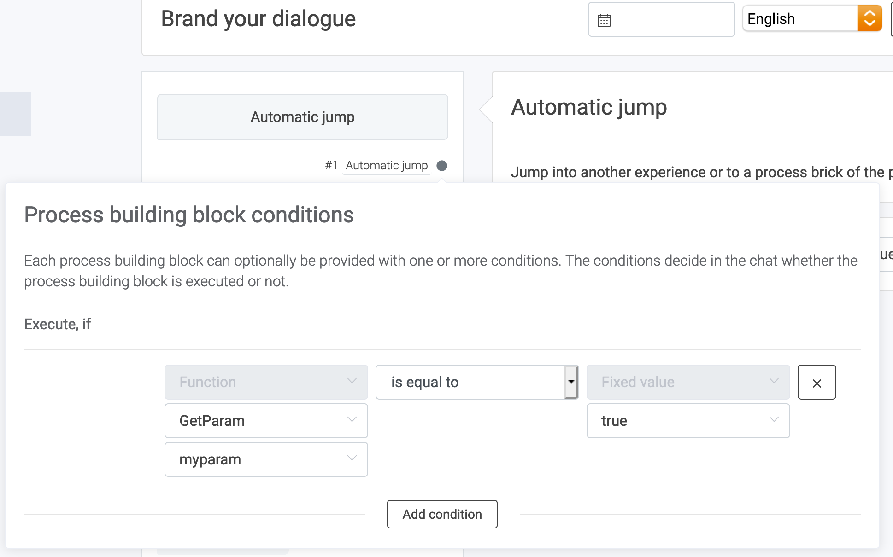

There are two ways to have dynamic experiences on one landing page:
- Switching experiences in JavaScript
- Switching experiences in LoyJoy


# Switching Experiences in JavaScript

You can `boot` LoyJoy with different processes, depending on conditions you choose. 

One common condition is a URL parameter. See this example:

```javascript
const loyjoyParam = getParameterByName("loyjoy-process");

let process;

if (loyjoyParam == null) {
  process = "<default-process-id>"; // default: Navigation über Landing Page
} else if (loyjoyParam === "quiz") {
  process = "<quiz-process-id>"; // Quizzes
}

LoyJoy("boot", {
  "bot": "<bot-id>",
  "process": process
})
```

Here, `loyjoy-process` is the URL parameter we chose to determine which process to `boot`. `getParameterByName` is
simply a function that gets us the value of URL paramter.

# Switching Experiences in LoyJoy

When booting LoyJoy, we can hand over arbitrary parameters:

```javascript
LoyJoy("boot", {
  "bot": "<bot-id>",
  "params": {
    "myparam": user.hasCamera
  },
  "process": "<process-id>"
})
```

The parameter `myparam` is now freely available in LoyJoy. Parameter names can be chosen freely.

Inside LoyJoy, we can access this parameter and, for example, make an automatic jump based on it:



Here, we trigger an automatic jump, if the given parameter is has the value `true`. This jump can lead
to a specific position in the process or to another process altogether.

