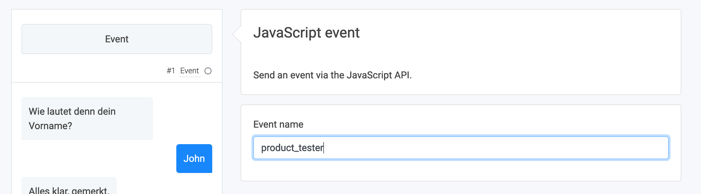

# Facebook Pixel Integration

The Facbook Pixel is a JavaScript snippet that is used to track specific actions of a website visitor.

Right now, it is not possible to include the Facebook Pixel in the Chat itself. However, LoyJoy’s 
[JavaScript API](JAVASCRIPT_API.md)
makes an easy integration via the website possible.

Our [JavaScript API](JAVASCRIPT_API.md) allows the website to handle events that are triggered in the
chat. Some events are triggered [automatically](GOOGLE_TAG_MANAGER.md), but you can also set-up
custom events to be triggered inside the chat.

Create your own pixel integration in three steps:
1. Choose/create the event you want to track
2. Ensure the Facebook Pixel integration on your page
3. Integrate the Facebook Pixel integration with the LoyJoy JavaScript

## 1. Choose/Create an Event to Track

We could choose one of the [events already present](GOOGLE_TAG_MANAGER.md) in LoyJoy. For example `newsletter_opt_in`
will be triggered when a customer gives a newsletter single opt-in in the chat.

But we can also add custom event. For this, we can drag an `Event` process building block into our process and then
define the name of the event to be triggered at this point in the process:



Here, we choose the name `product_tester` as an example. Now we can continue with the integration on the website.

## 2. Facebook Pixel Page Integration

This is the basic script. It has to be integrated into the HTML of the website.
```html
<script>
!function(f,b,e,v,n,t,s)
{if(f.fbq)return;n=f.fbq=function(){n.callMethod?
n.callMethod.apply(n,arguments):n.queue.push(arguments)};
if(!f._fbq)f._fbq=n;n.push=n;n.loaded=!0;n.version='2.0';
n.queue=[];t=b.createElement(e);t.async=!0;
t.src=v;s=b.getElementsByTagName(e)[0];
s.parentNode.insertBefore(t,s)}(window, document,'script',
'https://connect.facebook.net/en_US/fbevents.js');
fbq('init', '522344231566343');
fbq('track', 'PageView');
</script>
```

The script creates the `fbq` function, initialises the tracking and tracks a pageview. We can use this function in the next
step to track chat events in Facebook.

## 3. Send Events from LoyJoy to Facebook

We also have to integrate the `fbq` function into the LoyJoy startup script. This example will trigger the facebook
tracking whenever a LoyJoy event called `product_tester` is triggered:

```html
<script>
LoyJoy('boot', {
  bot: BOT_ID,
  eventListeners: [function (evt, obj) {
    if (evt === 'product_tester') {
      fbq('track', evt)
    }
  }],
  process: OPTIONAL_PROCESS_ID,
  serviceWorkerPath: OPTIONAL_SERVICE_WORKER_PATH,
  tenant: OPTIONAL_TENANT_ID
})
</script>
```

