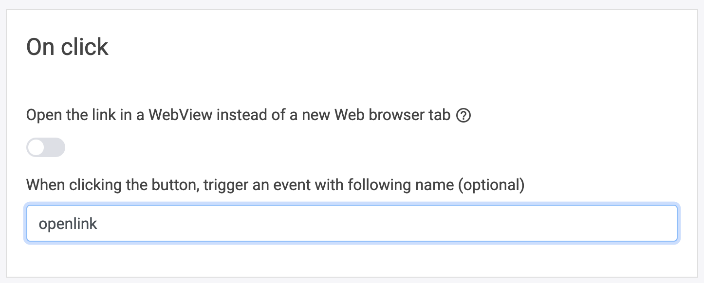
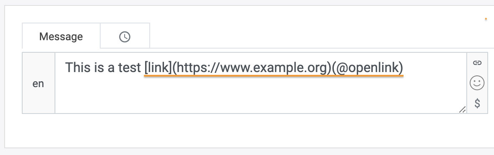

# How to navigate your website using LoyJoy

## 1. What this solution will do for you

You can use external links in LoyJoy to navigate customers on your website.

## 2. What you need for this solution to work

You will need to adjust the integration snippet and add events to the links
in the flow for this integration to work.

## 3. Adjust the integration snippet

You have to add a few lines for code to your LoyJoy integration snippet.
Basically, we have to program our snippet to react to link clicks in LoyJoy
by redirecting the user to the referred page without opening a new tab

```html
<script src="https://cloud.loyjoy.com/widget/BOT_ID"></script>
<script>
  LoyJoy("boot", {
    "bot": "<BOT_ID>",
    "process": "<PROCESS_ID>",
    "eventListeners": [function(evt, obj) {
      if (evt && evt === 'openlink' && obj && obj.url) {
        window.location.href = obj.url
      }
    }]
  });
</script>
```

We are adding code to run on all events that LoyJoy emits. We check wether the
current event is a link click (name is `openlink`) and if it is and there is a
url, we open the url in the same window.

## 4. Have the links emit the correct event

With the snippet in place, we only have to tell LoyJoy to trigger the `openlink`
event when a link is clicked.

In LoyJoy the default behaviour for a link click is to open the URL in a new
tab (native browser behaviour). To change this, you can use the setting
"When clicking the button, trigger an event with following name (optional)"
in the external link module. We have to use the event name from the snippet here
(`openlink`).

<p align="center">
  
</p>

Additionally, you can use the markdown syntax
`[Text](https://www.example.org)(@openlink)` (the `@` is required in front of
the event name) to trigger an event instead of opening the link in a new tab.
This way, you can also have link have links in normal text messages navigate
your website.

<p align="center">
  
</p>
