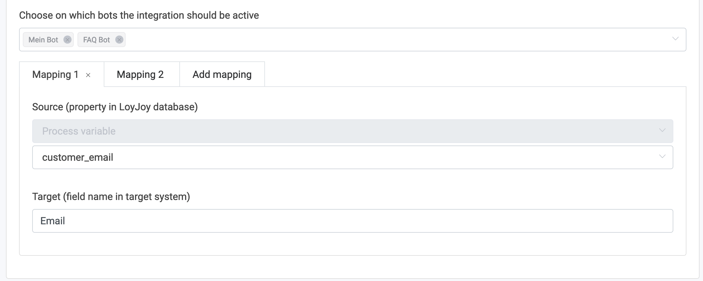
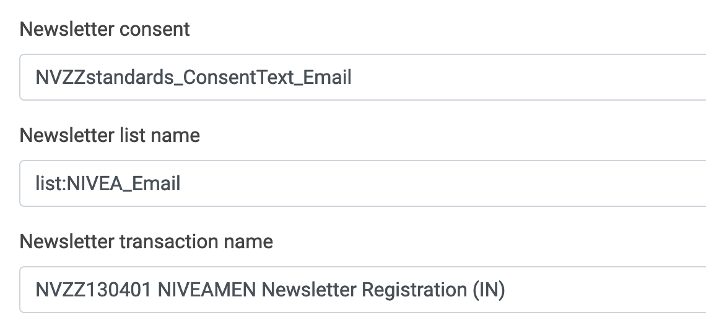
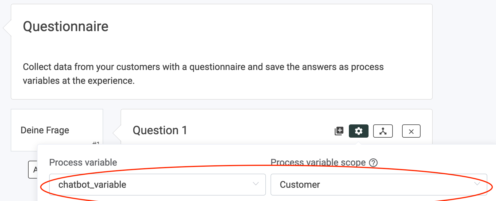
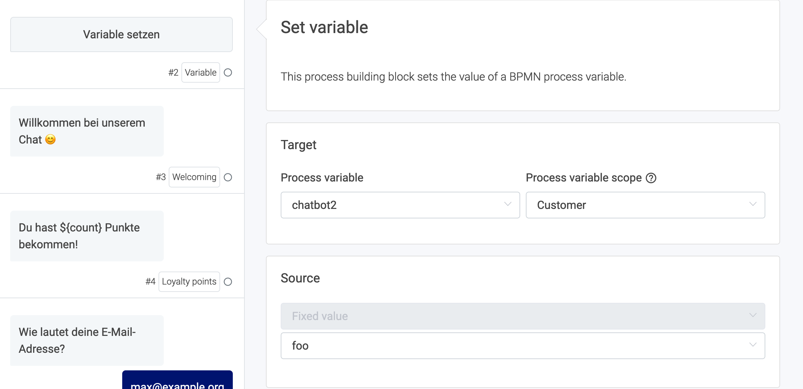

# ProCampaign Integration

In this article you'll learn how to transfer data from LoyJoy to ProCampaign. Basically, all kinds of data can be flexibly sent to ProCampaign as attributes.

## Consider before starting

Your API key for ProCampaign must be set up to *allow writing of the attributes that you want to send*. Please also make sure you configured all the required settings in LoyJoy at settings > integration.

## Configure the integration

Start with the mapping from LoyJoy to ProCampaign in LoyJoy's integration section. 

Here you can set the data mappings for the following transactions that will *automatically* transfer data to ProCampaign:

  - Newsletter opt-in (single-opt-in is sent to ProCampaign, double-opt-in email sent via ProCampaign)
  - Reminder single-opt-in (single-opt-in is sent to ProCampaign, double-opt-in email sent via ProCampaign)
  - Giveaway (raffle) participation
  - Instant win participation
  - Advent calendar winners
  - Postal address
  - PIN email
  
The following screenshot shows an example for newsletter settings.
  

## Define custom data points (variables) in LoyJoy

As you know, in LoyJoy you can create custom variables and store them in the customer database. You can pick any customer variable that is stored in LoyJoy and send them to ProCampaign. Variables can be set for example via the "Variable" process building block or in a "Questionnaire".

Here is an example for a variable created in a questionnaire.

Here is an example for a variable set with the "Variable" process brick.

## Send your data to ProCampaign

- As mentioned above, some transactions in LoyJoy send data to ProCampaign automatically based the mappings in settings > integration
- Additionally, you can trigger to send data to a ProCampaign transaction with the "ProCampaign" building brick

  
## List of default variables in LoyJoy

The following customer data fields (or variables) are *always* accessible:

- customer_country
- customer_email
- customer_firstname
- customer_gender
- customer_id
- customer_language_iso_6391
- customer_lastname
- customer_locality
- customer_phone
- customer_region_iso_31662
- customer_street
- customer_surrogate_id
- customer_zipcode

