# Get started

Welcome to the LoyJoy Conversation Marketing Cloud! We are excited to have you on board. Very soon you will be able to build your own awesome customer journeys yourself. Let’s get you started!

This article will guide you through your very first access to the LoyJoy platform and help you understand the wide range of possibilities available for you to build customer journeys that will excite your customers. 

## How to log in

Find out how you will grant access to the LoyJoy platform, why we do not use passwords and how to log in.

## How to set up a chatbot from scratch

Discover the Chat Editor and how you can edit the wording and the chat process flow. Use our live demo to test your chatbot.

## How to adjust the branding

Brand your chatbot, add a logo and define the chat style.

## How to go live

Use your individual landing page to test and discover your options to publish your chatbot.

## How to measure success

Dig deeper into your consumer's experience and track your success. Find out what your consumers have to say.

### How to log in

First of all, you get an email with a link from the LoyJoy team. Our System works without a password. Instead of that, you will receive a “Magic Link”. In the email you have received, you must click on “Confirm my account”.

  

Afterward, there will open another page of LoyJoy. Here you must type in your email address.

  

Next, you will get another message which tells you that you have received another email with a magic link. Open this email and click on “Sign in to LoyJoy”

  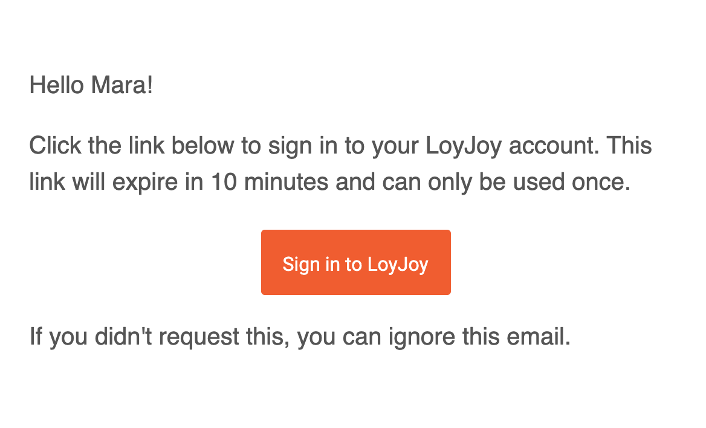

Then you are on our start screen.

### How to set up a chatbot from scratch

  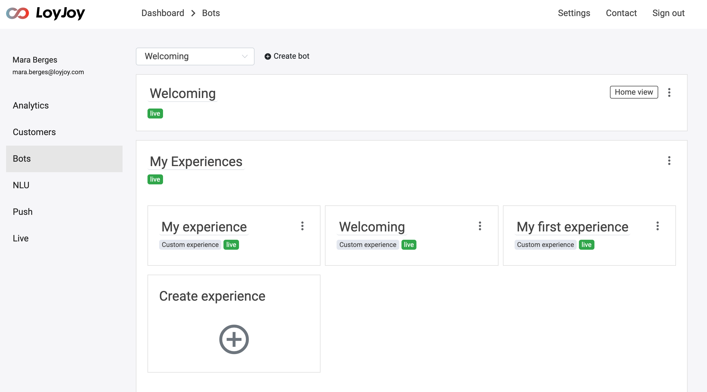

Now it's up to you whether you want to create a new experience or modify an existing one.
To discover the existing experience you need to click on the bar.

  

As you want to start you have different options: You can create your personal experience or you copy an existing experience and change or test it. 

#### Copy an existing experience

If there is already an experience that you like or that you want to change, you can copy it. This way you can change it as you like and the other experience remains the same. 
To copy the experience of your choice, you must click on the three dots. Then choose "copy experience". 

  

Then copy the link.

  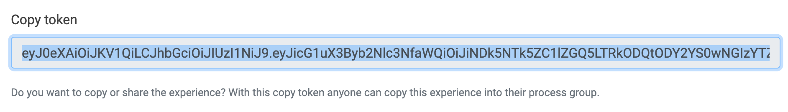

Afterward, you have to scroll down and click on "create experience". 

  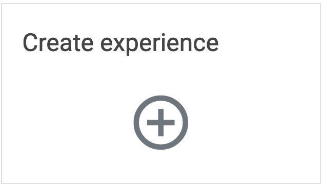

Again, scroll down and then paste the copied link. Finally, click on "Paste experience". Immediately you have your own experience. 

  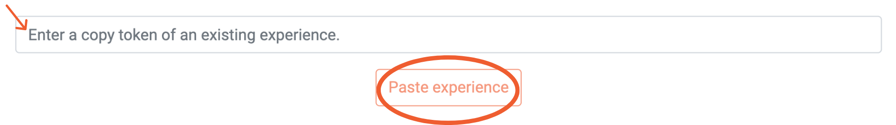

Give the copy a new name so you know which version is the new one.

  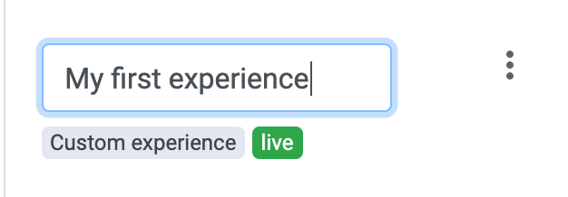

Now you have done it and can start with your copied experience.

#### Create a new experience

To create your own experience, you must first click on "create experience".

  

 Then you have to decide whether you want to create an experience all by yourself or whether you want to work with an example. 

  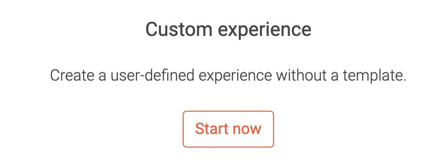

  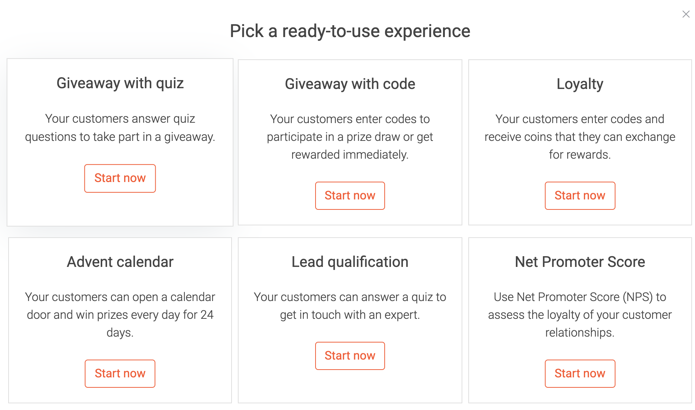

Once you have chosen a template, click on "start now" at the experience of your choice. When you have decided to start over, click on "Custom experience".

You did it! Now you can start!

#### New experience

Now we are diving right into the process editor. 
Here you can choose how your flow should look like. On the left side, you can see all the process blocks (Link Process Bricks)
that are available to you. On the right side, you can see how your current flow looks like.

  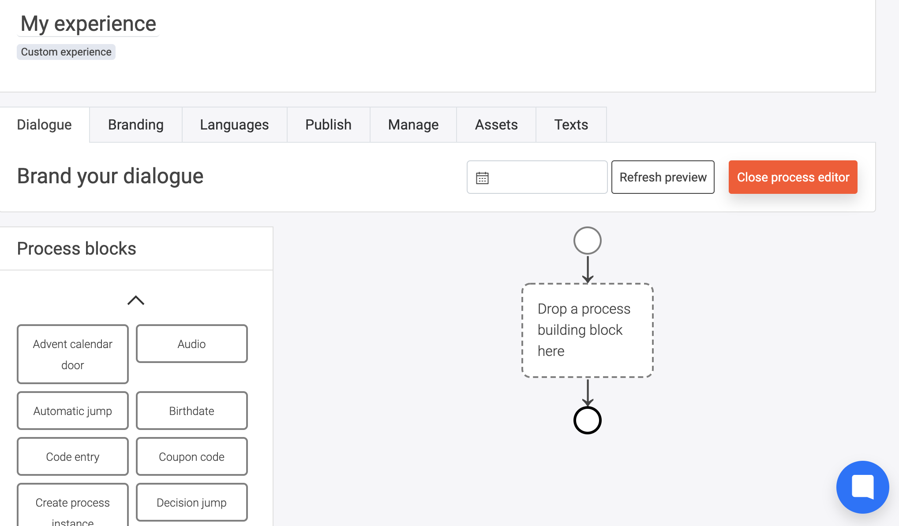

First, you choose which building block you would like to have in your flow. You then drag it to the right side.

  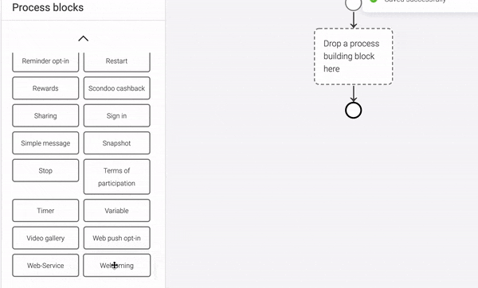

If you have made a mistake, you can simply drag it back again.

  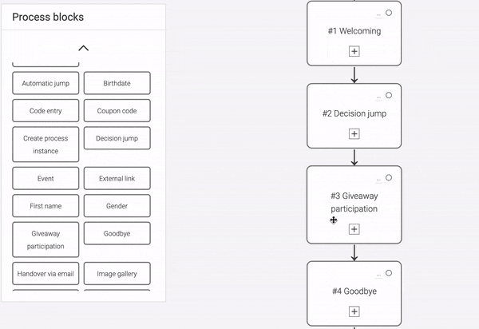

Even a wrong order is no problem. If you want to swap individual building blocks, simply drag them into the correct order. Don't worry, texts that you have already inserted will remain.

  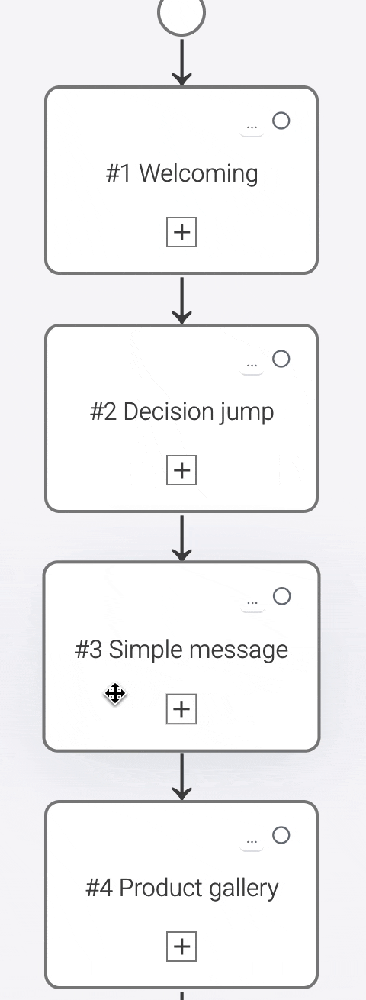

Once you have added a process block, you can edit it. To do this, you click on "Close process editor". 

  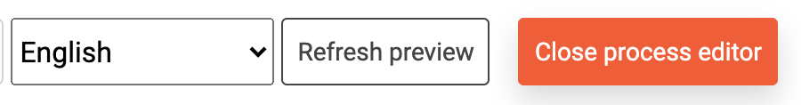

Now you can enter whatever you want in the text fields. 

  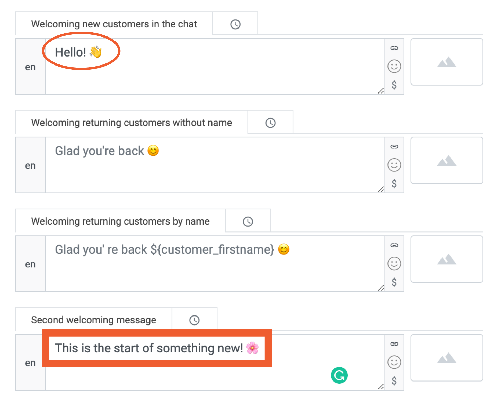

If you want to add links, smileys, or variables you have to click on the small button at the end of the text field. 

  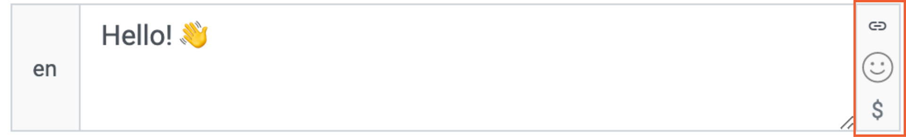

With the first button, you can add links. With the button, you get a template that you have to fill in. In the square brackets is the text that will be displayed by the chatbot. In the round brackets, the link is placed. 

  

You will not see this link afterward.

  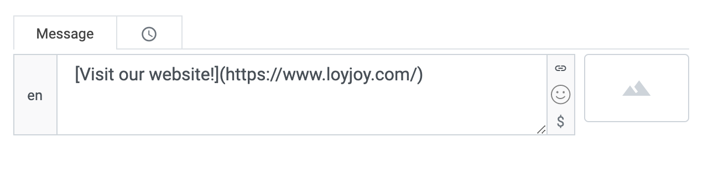

  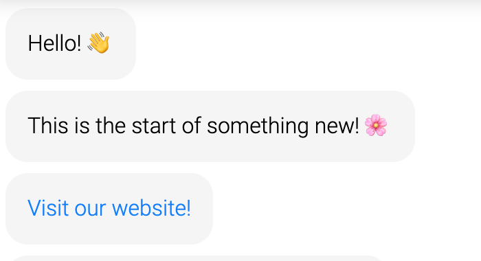

With the second button you can select smileys. 

  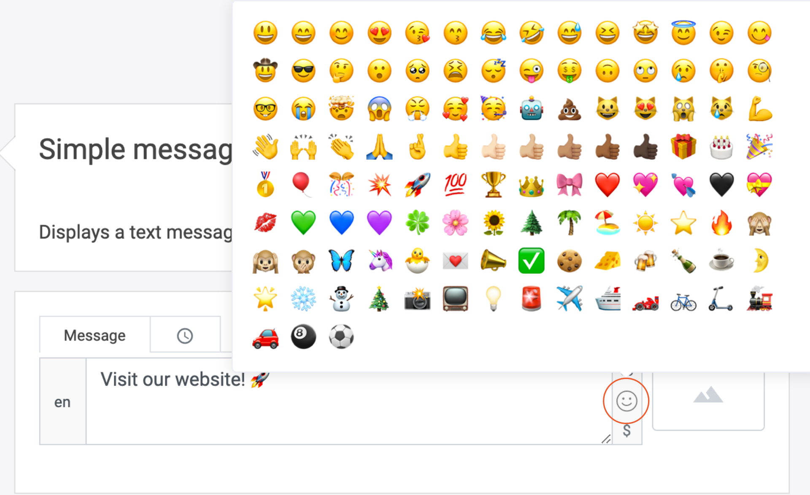

> If you click on the last button you can add variables. If, for example, a customer has already entered his or her name, it can be used in the greeting

  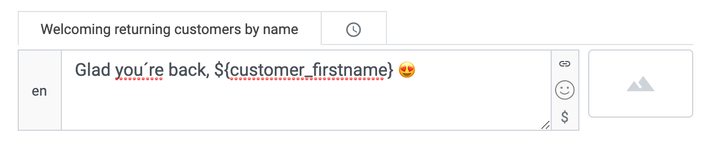

To make your flow clearer, you should give the individual building blocks appropriate names. This is especially helpful in the Process editor, because there you don't see the contents, but only the names. 

  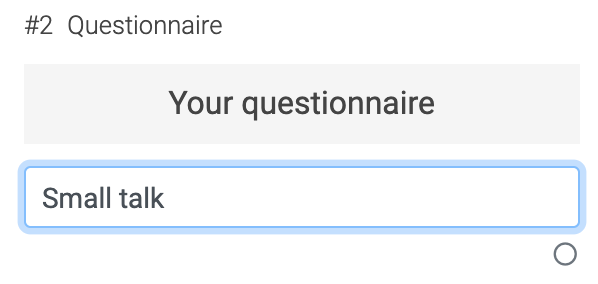

If after a while you want to see how your chatbot looks like now and if it works, click on refresh preview. 

  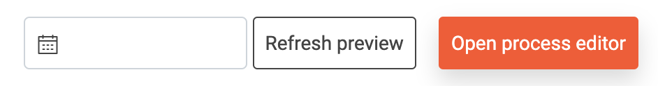

Then click on the button in the bottom corner.

  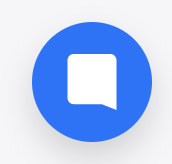

 This opens your chatbot. 

  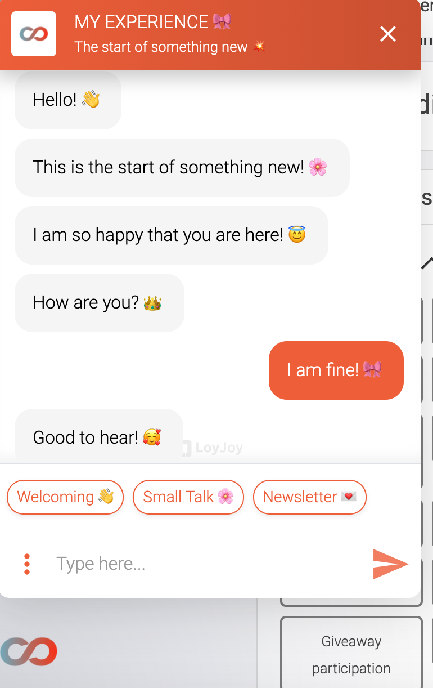

Every time you change something and want to see the chatbot afterward, you have to click on refresh preview. If you don't do this, you will always see the old version. 

The chatbot saves automatically! There is no action needed.
