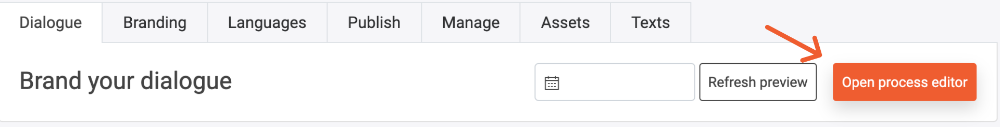
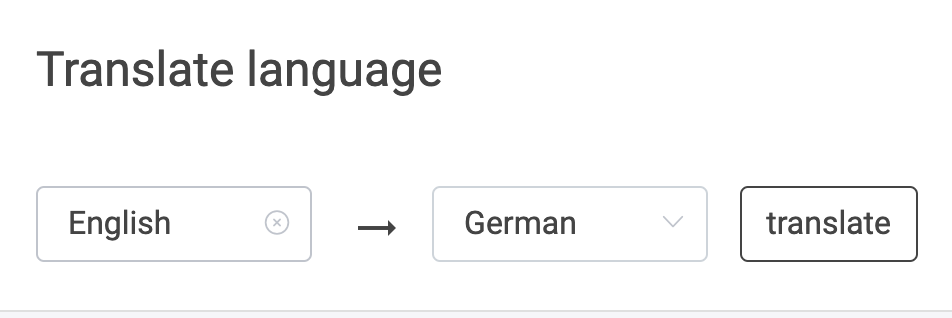
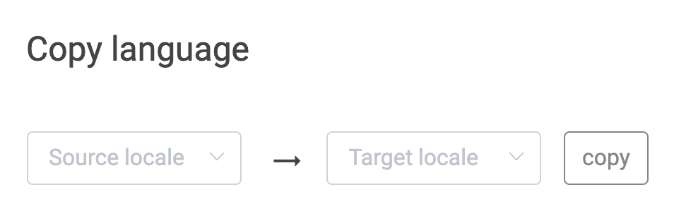

  

# Get started with the Conversational Marketing Cloud
We are excited to have you on board of the LoyJoy Conversation Marketing Cloud! Very soon you will be able to build your own awesome customer journeys yourself. Let’s get started!

This article will guide you through your very first access to the LoyJoy platform and help you understand the wide range of possibilities available for you to build customer journeys that will excite your customers. 

### [How to log in](#how-to-log-in-1)

Find out how you will grant access to the LoyJoy platform, why we do not use passwords and how to log in.

### [How to set up a chatbot from scratch](#how-to-set-up-a-chatbot-from-scratch-1)

Discover the Chat Editor and how you can edit the wording and the chat process flow. Use our live demo to test your chatbot.

### [How to adjust the branding](#how-to-adjust-the-branding-1)

Brand your chatbot, add a logo and define the chat style.

### [How to manage content](#how-to-manage-content-1)

Upload your assets, edit your texts and export your giveaway winners easily.

### [How to go live](#how-to-go-live-1)

Use your individual landing page to test and discover your options to publish your chatbot.

### [How to measure success](#how-to-measure-success-1)

Dig deeper into your consumer's experience and track your success. Find out what your consumers have to say.

## How to log in

After your first call with the LoyJoy team, you will receive an email from us inviting you to the LoyJoy platform. Please click “Confirm my account” within 24 hours to acctivate your access your tenant on the LoyJoy platform. Think of your tenant as being your team's personal playground to create chat experiences and much more. 

  

After confirming your account, please type in your email address to access the tenant.

  

Everybody has troubles remembering passwords. That's why re retires the password for good. Each time you will log in to the LoyJoy platform, we will send you our magic link via email. Click the link in the email to access the platform.

  

Tada! Welcome to the LoyJoy platform. It's where the magic happens! :tada:

## How to set up a chatbot

In the backend you can have several starting points. You can either start an experience by using a copy of an existing one, you can use our ready-to-use experiences that give you a process flow to customize yourself, or you can start from scratch with a blank process.

  

#### Option 1: Copy an existing experience

Imagine your colleagues have built an amazing chatbot experience which got your inspired to start your own project. To benefit from their work, you can simply copy their experiences and work on your customizations and modifications with the copy. Click on the three dots of the chat experience you wish to copy and select "Copy Experience".

  

  

Now click " Create Experience" in the chatbot to which you want to add the experience.

  

Simply paste the copied link.

  

Now you can rename your chatbot to your wishes.

  

Great! Now you can start [editing your chat experience](#The-Chat-Flow-editor)! :tada: 

#### Option 2: Create a new experience

To build your own experience, click on "Create Experience".

  

Now decide whether you make use of our great ready-to-go experience or if you prefer to start from scratch. We recommend checking out the ready-to-go experiences as they provide you with the logical structure of your chat flow based on your objectives. 

 
 

Amazing! Let's start customzining your experience to your wishes! 

#### The Chat Flow Editor

Let's dive right into the Process Editor, the heart of every chat flow. On the left side, you can find [all process blocks](https://github.com/loyjoy/welcome/blob/master/documentation/process_building_blocks/PROCESS_BUILDING_BLOCKS.md) to use for your chat flow. 

  

Simply drag and drop the process blocks into your flow.

  

Once you have added all your process blocks, the next step would be editing. Click "Close process editor" to open the Chat Flow Editor.

(Screenshot Chat Flow Editor full screen)

  

Feel free to insert your prefered text into the text fields. Click on each process block to edit its texts.

  

To add hyperlinks, emojis and variables to your texts, click on the small button at the end of each text field. 

  

Adding a hyperlink to your text will require a link text (in square brackets) and an URL link (in round brackets).

   

This is how a hyper link looks like for the user.

  

Select exciting emoticons to engage emotionally with your consumers. Take advantage of our selection, where all emoticons are checked for aesthetics on all operating systems. But you are not limited - Insert any emoji by simply pasting it into the text field.

  

Add variables to individualize your texts for every customer. Address them by their first name when returning to your chatbot, provide content specific data or link variable data to your text field. 

  

To make sure you stay on top of your chat flow, you can name your process blocks according to their use. This helps you to nativcate through your flow when complexity grows.

  

Now it is time to try out what you have built up so far. Hit "Refresh Preview" and open the chat window by clicking on the chat bubble at the bottom. 

  
  

Your chatbot will open and you can check out your progress. Whenever you wish to restart the flow, simply press "Refresh Preview" again.

  

Do not worry about saving your progress. We have your back! Every edit is automatically saved.

## How to adjust the Branding

Let's brand your chatbot to your perferences together. Give your chatbot a name and attract customers with a slogan. Add a placeholder for the open text field, if you wish so.

  

Then you can add the logo to your brand. It will appear in the upper right corner of the header of your chatbot.

  
  

You can also choose the main color for your chatbot matching the brand's style.

  
  

An email address must be set to address customer inquiries.

  

Before a chatbot goes live, an imprint must be set.

  

If you are sending emails through your own mail domain, please fill out the following fields. Ask your LoyJoy Success Manager for assistance.

  

Some consumers will type something into the open text field at the bottom of the chatbot. In order to respond to customer input, we provide standard intents to respond empathically to customer inquiries. However, in some cases, our AI algorithm will not identify the input. Define a message to send out to your customers in that case or let them fill out a contact form so that the inquiry can be addressed personally.

  

You can set fixed buttons in your chatbot to offer your customers the option to jump right into a certain action by use our persistent quick replies.

  
  

## How to Manage Content

Your chatbot will contain of multiple types of content. This chapter aims to show you where you can set your language,find your assets, manage your giveaway winners and adjust your texts.

### Translate your Language

For you, it is of course important that you can build the chatbot in your language. To do this, click on "Language" and then select your language. Please also 
create the chatbot in English so that we can help you with questions and problems.

  

You can choose as many languages as you like. When you go back to the editor, you will see that there is a field for each selected language. 
Now enter your default language.

  
  

If you want, you can have the text translated automatically. But check afterward if everything is correct.

  

If you have swapped the fields, you can use this function to switch the languages. So if you have entered the German text in the Fled for English, you can have it
changed automatically here.

  

### Manage your Giveaways

If you have integrated a raffle or giveaway, you can see the participants here and draw the winner.

### Assets Overview

Here you find an overview of all used pictures and videos.

  

### Texts Overview

Here you find a list with all your contents

  

## How to launch your chatbot

You are done with your chatbot and want to show it to your colleagues? Or you want to customize other things outside the flow? Or you are finished and want to publish the chatbot? You are right under the tab "Publish".

  

By clicking on "Open landing page" you can view the chatbot on a landing page. You can also share the link and make it available to your colleagues. 

  

Our example could look like this:

  

You also can view the chatbot on your smartphone. Just scan the QR code.  

  

If you enter the URL of your homepage here, you will see the bot already there.

  

When the chatbot is completely finished and you want to add it to the code of your website, you can find the corresponding HTML codes here. 
All three codes must be used.

  
  
  

The chatbot can be used not only on one website but also on various social media channels. 
To use the chatbot on Instagram, use this link:

  

For all other channels contact the LoyJoy Team.

  

You have different settings for the chat window and the chat bubble. Here you can see our standard settings:

  

You might have noticed in the example that the landing page and the chat bubble is adapted to LoyJoy. You can also do this for your company. Here you can insert a logo, which will be used as a chat bubble:

  

The image that you insert here will be your landing page:

  

It is also up to you if and how the chat bubble should be animated. These are the different possibilities you have:

  

### How to measure success

Nothing is better than success. Find your boosted performance and learn about your consumers under the Analytics tab.

  

General information such as the screen time, participants, and newsletter subscribers can be found here.

  
  

Understand in which language and at what time your chatbot is used the most. Depending on your chatbot type, you will find all the collected data in the Analytics.

  
  
  
  
  
  

