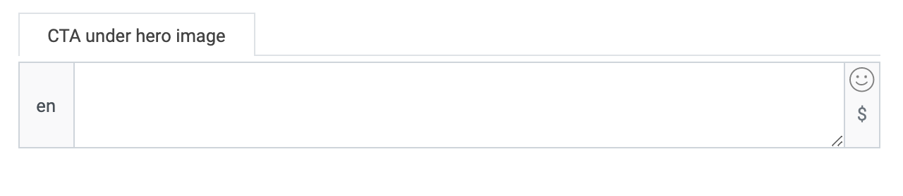

  

# Start with home view

Welcome to the LoyJoy Conversation Marketing Cloud!
This article will guide you through the features of home view. Home view is a start page for various chatbots or stories. From here you can easily navigate to your
different experiences. You can also create and add stories. 
Home view has added value for you because you can create different chatbots on different topics and find them on one page without your customers visiting every page
of your homepage. 

  

You can also provide your customers with short videos and pictures by adding stories. This promises more proximity to your customers! 

BILD STORIES

To start with Home view, click on the Home view button. Make sure that you are in the right bot. In our example, we build a home view about the bicycle. We have
already created two experiences that we will use in the home view.

  

Now there are several widgets that you can add to your home view. 
To do so, click on the plus of the widget of your choice.

  

With the minus, you delete widgets that you no longer need. 

## Navigation bar

Let's start with the navigation bar. 

  

Here you can add a photo that will be displayed at the top of the page like a header.

  
  

## Hero widget

The hero widget includes an image with possible text. 

  

This widget can be used as a welcome widget. You can give the widget a title, add a photo and text or greetings. 

  
  

Here you can add a call to action.

  

From here you can navigate to an experience, but you do not have to.

  

## Groups widget

Using the groups widget, customers can access the individual experiences that you have previously created.

  

For each experience you can add an image and avatar image and choose a title and slogan. There are different ways to display the experiences. 

  

If you want the images and texts to be displayed in the home view, click here. 

  

This is how the example would look like in home view afterward:

  

## Notifications widget

This widget shows push up messages for the customer.

