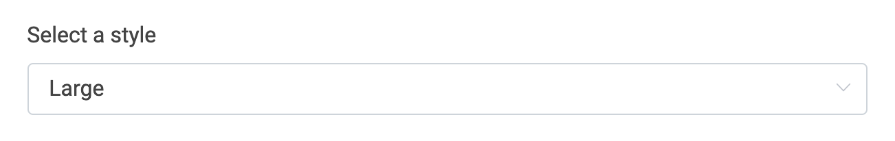
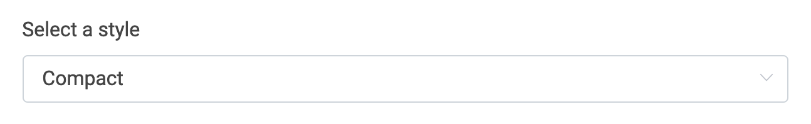
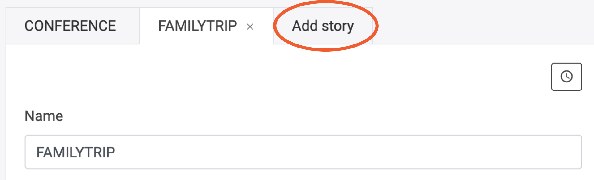
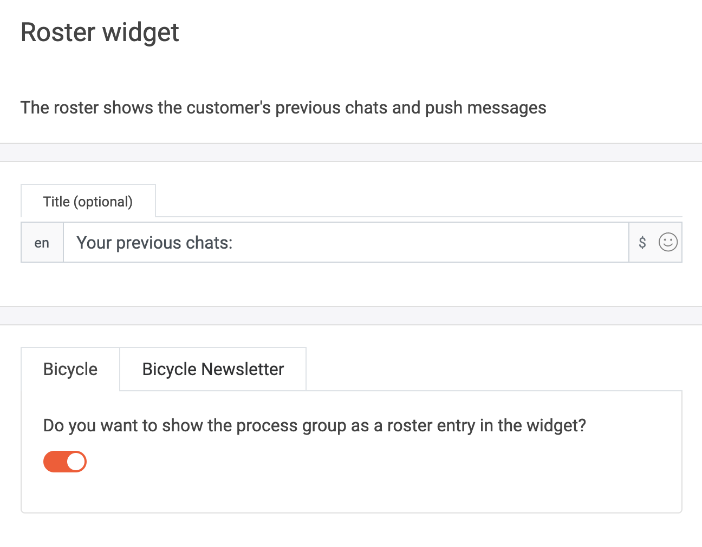

  

# Home view

Welcome to the LoyJoy Conversation Marketing Cloud!
This article will guide you through the features of home view. Home view is a start page for various chatbots or stories. From here you can easily navigate to your
different experiences. You can also create and add stories. 
Home view has added value for you because you can create different chatbots on different topics and find them on one page without your customers visiting every page
of your homepage. 

  

You can also provide your customers with short videos and pictures by adding stories. This promises more proximity to your customers! 

## List of widgets

You just need help with a widget or are looking for something special? Jump directly there!

- [Start with home view](#Start-with-home-view)
- [Navigation bar](#Navigation-bar)
- [Hero widget](#Hero-widget)
- [Stories widget](#Stories-widget)
- [Notification widget](#Notification-widget)
- [Roster widget](#Roster-widget)

### Start with home view

To start with Home view, click on the Home view button. Make sure that you are in the right bot. In our example, we build a home view about the bicycle. We have
already created two experiences that we will use in the home view.

  

Now there are several widgets that you can add to your home view. 
To do so, click on the plus of the widget of your choice.

  

With the minus, you delete widgets that you no longer need.

You can also change the order in which the widgets appear. It does not matter if you have already added images and text or not. The order will change in the home 
view.

  

### Navigation bar

Let's start with the navigation bar. 

  

Here you can add a photo that will be displayed at the top of the page like a header.

  
  

### Hero widget

The hero widget includes an image with possible text. 

  

This widget can be used as a welcome widget. You can give the widget a title, add a photo and text or greetings. 

  
  

Here you can add a call to action.

  

From here you can navigate to an experience, but you do not have to.

  

### Stories widget

Through stories, you can get even closer to your customers. Insert small video sequences to inform customers or to bring a product closer to them, for example.

  

First, you add a new story.

  

Then choose how large your avatar image should appear. It can be large or small in the home view. Choose what you like better.

Large looks like this:

  
  

Compact would look like this:

  
  

In order for a story to appear, you must add the URL to the story.

  

Additionally, add an avatar image and logo. 

  

You can also add a call to action and a process jump.

  

To add more stories, click again on add story.

  

To view the story now, click on it. Our example would now look like this:

  

### Groups widget

Using the groups widget, customers can access the individual experiences that you have previously created.

  

For each experience you can add an image and avatar image and choose a title and slogan. There are different ways to display the experiences. 

  

If you want the images and texts to be displayed in the home view, click here. 

  

This is how the example would look like in home view afterward:

  

### Notifications widget

  

This widget shows push up messages for the customer.

  
  

### Roster widget

The roster shows the customer's previous chats and push messages. 

  

If you want the roster to be displayed in the home view, click here. 

  

This is how it could look like:

  
  

