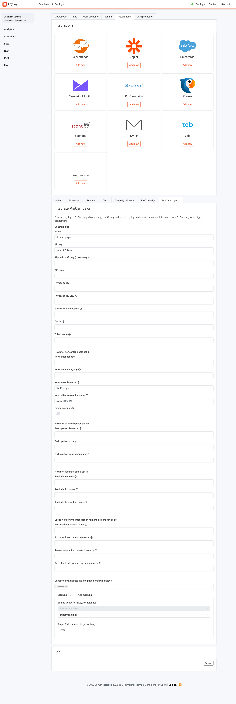

# ProCampaign Newsletter Integrations

LoyJoy can send newsletter single opt-ins (SOI) to ProCampaign automatically. Note: this is a one-way integration.

To start sending newsletter SOIs from LoyJoy to ProCampaign we only need three things:
- the name of the transaction in ProCampaign
- the name of the list in ProCampaign 
- an API key that is allowed to modify the attributes / send the transaction

Only 2 steps are needed to configure this integration in LoyJoy

1. Create a Bot with a Newsletter sub-process.

2. Configure a ProCampaign integration in LoyJoy.
  1. Enter the API key, list, and transaction into the newsletter fields.
  2. Activate this integration for the Bot you are using.
  3. Create a mapping for the email field (optional: other fields, all fields present will be sent).

Note: Please make sure that no fields that your API key has no privileges for are added in the ProCampaign integration settings.

## Optional Fields in the Integration Settings
- Newsletter consent: If set, will be sent as an attribute and filled with the text the user confirmed in the chat
- Ident_long: Ident_long transaction parameter (Defaults to "Newsletter Subscription")
- Create Account: post data to `Account/Register` instead of `Consumer` endpoint

From the general settings:
- `Privacy policy` & `Privacy policy URL`: Content from the URL can be written to an attribute with the name given in the
  `Privacy policy` field
