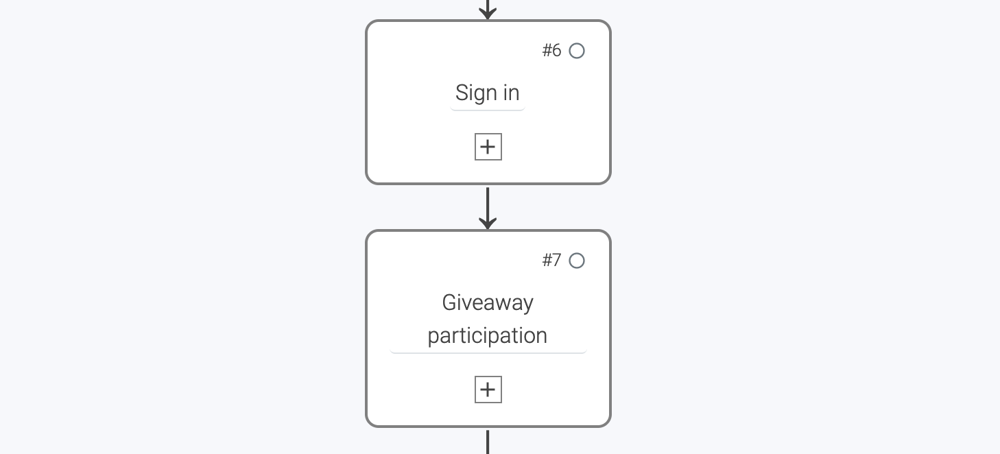

# How to transfer giveaway participants from LoyJoy to ProCampaign

## 1. What this solutions will do for you

LoyJoy lets you create a giveaway for your customers within the chat experience. Your customers will be asked to enter their email address in order to participate. 
In addition you can draw the winners on the platform and export them.

You can **automatically transfer your new giveaway participants to your ProCampaign database**. LoyJoy will transfer your participants' email addresses to ProCampaign.

## 2. What you need for this solution

To start transfer the participants from LoyJoy to ProCampaign you will need three things - your ProCampaign admin will help you out with this:

 - The **Participation transaction name** in ProCampaign.
 - The **Participation list name** in ProCampaign.
 - The **API key that has the needed rights** to send the transaction.

## 3. Add the `Giveaway participation` process block to your chat flow

Create or copy an new experience and add the `Giveaway participation` process block. 

  

Turn off the double-opt-in email in LoyJoy (as this email will be sent by ProCampaign).

  

## 4. Configure the data transfer

You completed all the configurations within the chat. Now you have to set up the data transfer.

On the LoyJoy platform, go to settings, then choose integration. Choose ProCampaign and click on "Add now".

  

This will add a new tab with the name "ProCampaign" below the cards.

Scroll down to "General settings".

Set a name for your integration (since you can have several integrations this will help you keep an overview).
Enter **your API key** that you got from your ProCampaign admin.

  

  

Scroll down to the section `Fields for newsletter single opt-in`. Now fill in the `Newsletter list name` and the `Newsletter transaction name` into the according fields in LoyJoy. 

  

The following fields are optional:
- `Newsletter consent`: If set, the text that the user confirmed to subscribe in the chat will be sent as an attribute to ProCampaign.
- `Newsletter Ident_long`: Ident_long transaction parameter (Defaults to "Newsletter Subscription")

Scroll down and activate the integration for your bot in the field "Choose on which bots the integration should be active". Click on "Add a mapping" to create a mapping for the email field. Then choose `process variable` and type in `customer_email` to refer to your data field in your chat flow. Now just type in the source name of the data field in ProCampaign `Email`.

  

Congratulations! You just have successfully connected your LoyJoy chatbot with ProCampaign and all Newsletter Opt-ins within the chat will automatically tranferred to ProCampaign.:tada:
