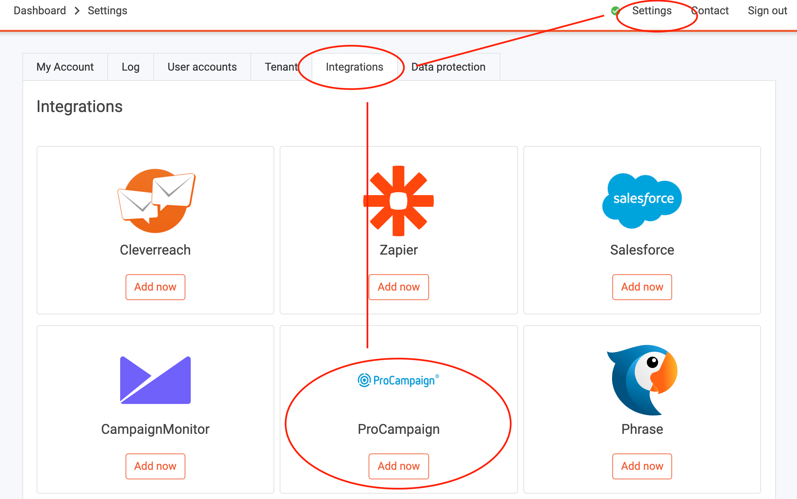
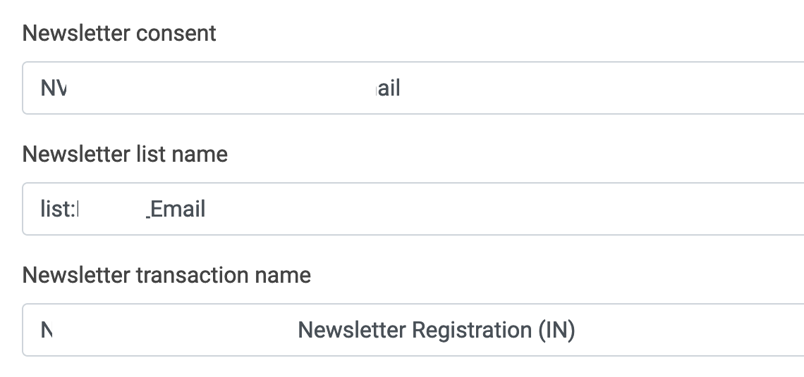
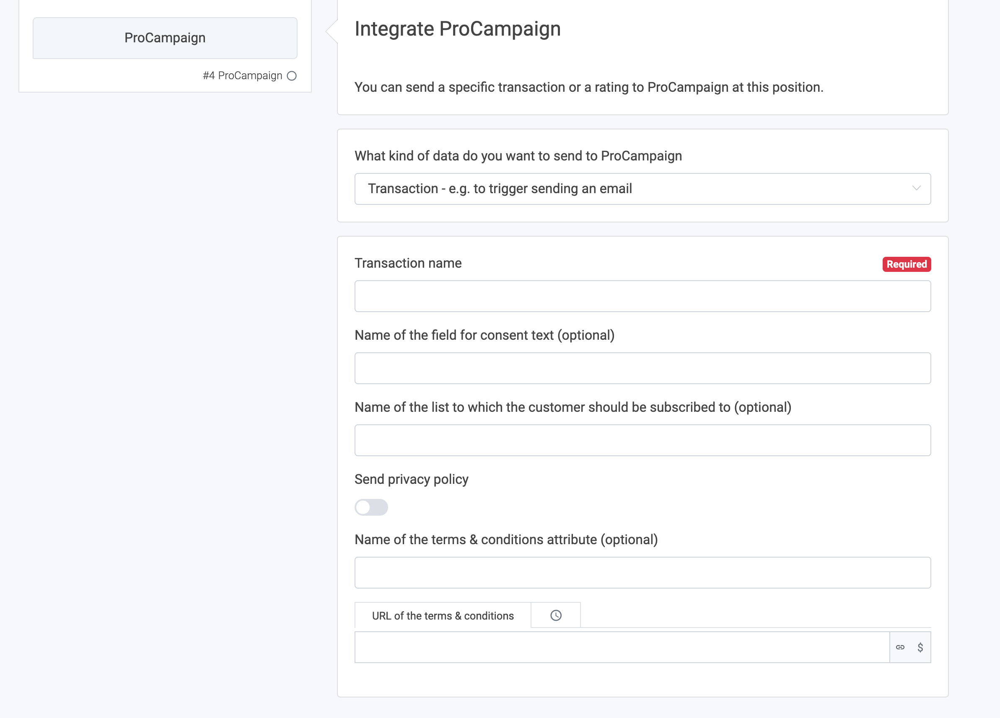

# How to transfer data from LoyJoy to ProCampaign

## 1. What this solution will do for you

In this article you'll learn how to transfer the following data from LoyJoy to ProCampaign:

  - Reminder email subscribers (single-opt-in is sent to ProCampaign, double-opt-in email sent via ProCampaign)
  - Giveaway (raffle) participations
  - Advent calendar winners
  - Postal addresses
  - PIN emails

## 2. What you need for the data transfer

You need an API key for ProCampaign that must be set up to **allow writing of the data fields that you want to transfer**. Your ProCampaign admin will be able to help you.

## 3. Configure the data transfer

In LoyJoy, go to settings, then choose integration. Choose ProCampaign and click on "Add now".

Scroll down until you see the "ProCampaign Integration". In the fields you can configure the data transfer.
  

  
The following screenshot shows an example for newsletter settings.
  

## 4. Define custom data points (variables) in LoyJoy

As you know, in LoyJoy you can create custom variables and store them in the customer database. You can pick any customer variable that is stored in LoyJoy and send them to ProCampaign. Variables can be set for example via the "Variable" process building block or in a "Questionnaire".

Here is an example for a variable created in a questionnaire.

Here is an example for a variable set with the "Variable" process brick.

## 5. Transfer your data to ProCampaign

You can trigger to send custom data to a ProCampaign transaction with the "ProCampaign" building brick. Add the brick to your process and configure it.

 
