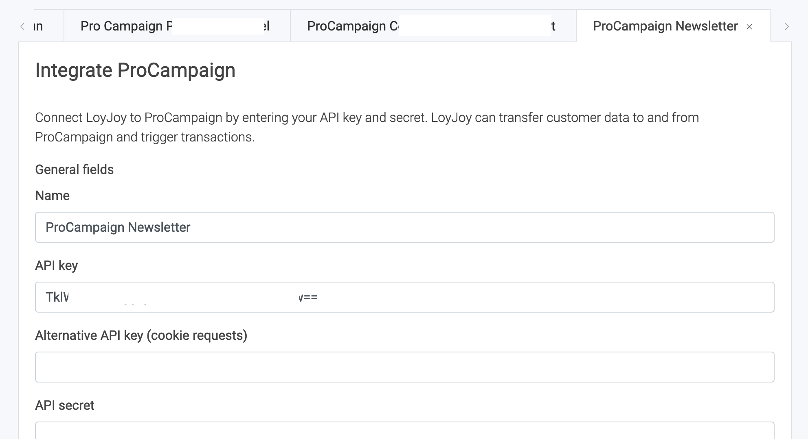

# How to transfer data from LoyJoy to ProCampaign

## 1. What this solution will do for you

In this article you'll learn how to transfer the following data from LoyJoy to ProCampaign:

  - Newsletter subscribers
  - Reminder email subscribers
  - Giveaway (raffle) participations
  - Advent calendar winners
  - Postal addresses
  - PIN emails

## 2. What you need for the data transfer

You need an API key for ProCampaign that must be set up to **allow writing of the data fields that you want to transfer**. Your ProCampaign admin will be able to help you.

## 3. Configure the data transfer

In LoyJoy, go to settings, then choose integration. Choose ProCampaign and click on "Add now".

  

This will add a new tab with the name "ProCampaign" below the cards.

Scroll down to "General settings".

- Set a name for your integration (since you can have several integrations this will help you keeping track of)
- Enter your API key that you got from your ProCampaign admin

  

Scroll down until you see a tab called "Add mapping". A mapping maps field names from LoyJoy to field names in ProCampaign.

- Choose the LoyJoy bot(s) that you want to use the integration in
- Click "Add mapping" to add a new mapping
- Choose "Process variable" from the Source dropdown
- Enter the variable name from LoyJoy that you want to transfer as Source
- Enter the target name of the data field that you store in ProCampaign

  
  

## 4. How to set custom data points (variables) in LoyJoy

As you know, in LoyJoy you can create custom variables and store them in the customer database. You can pick any customer variable that is stored in LoyJoy and send them to ProCampaign. Variables can be set for example via the "Variable" process building block or in a "Questionnaire".

Here is an example for a variable created in a questionnaire.

  

Here is an example for a variable set with the "Variable" process brick.

  

## 5. Transfer your data to ProCampaign

You can trigger to send custom data to a ProCampaign transaction with the "ProCampaign" building brick. Add the brick to your process and configure it.

 

  

