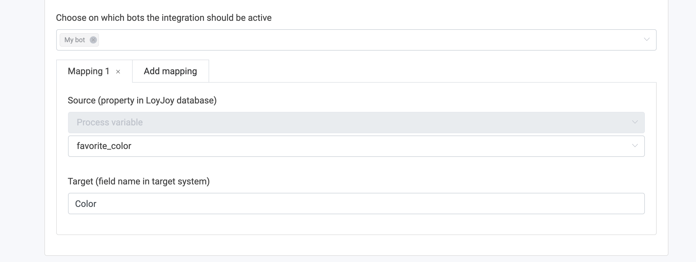
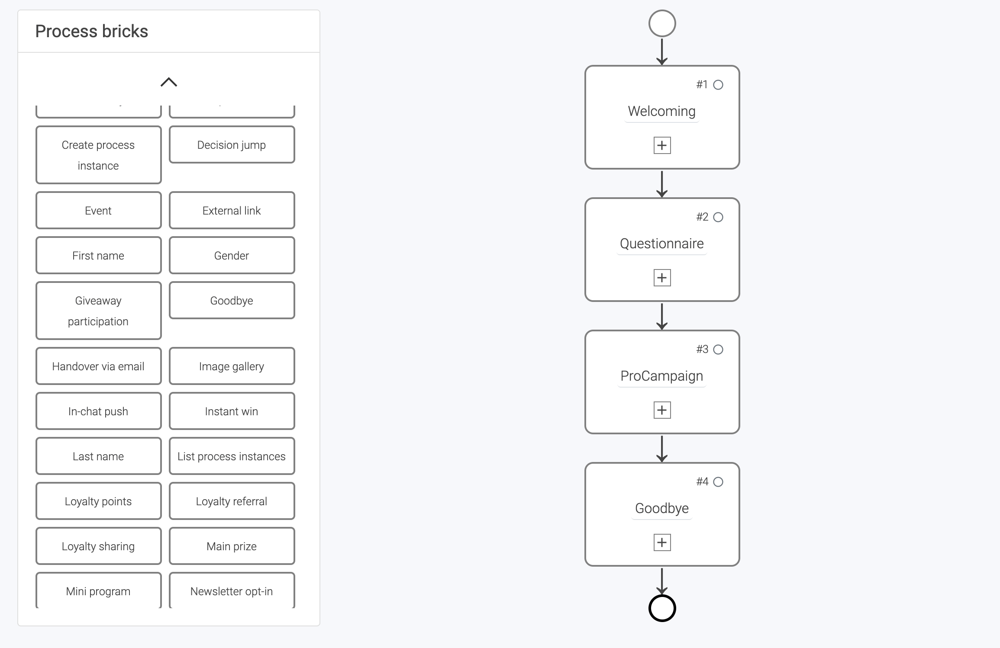
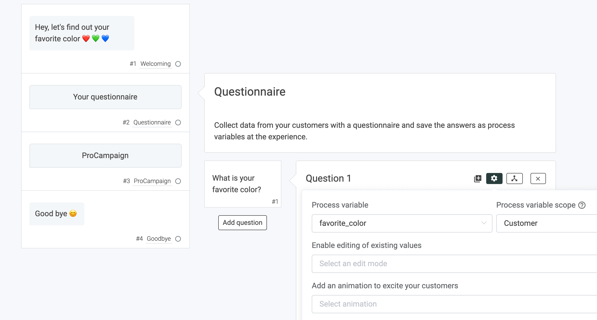
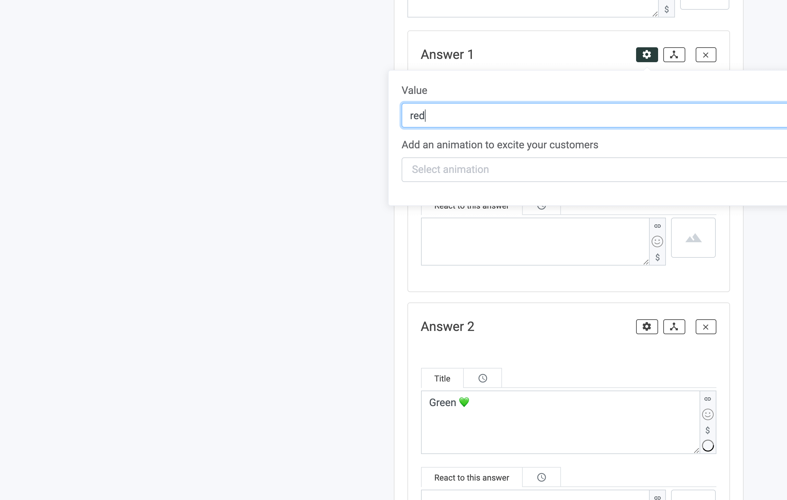

# How to transfer data from LoyJoy to ProCampaign

## 1. What this solution will do for you

In this article we explain how to generally transfer a custom data field from LoyJoy to ProCampaign. For this example we use the field "favorite color".

## 2. What you need for the data transfer

You need an API key for ProCampaign that must be set up to **allow writing of the data fields that you want to transfer**. Your ProCampaign admin will be able to help you.

## 3. Configure the data transfer

In LoyJoy, go to settings, then choose integration. Choose ProCampaign and click on "Add now".

  

This will add a new tab with the name "ProCampaign" below the cards.

Scroll down to "General settings".

- Set a name for your integration (since you can have several integrations this will help you keeping track of)
- Enter your API key that you got from your ProCampaign admin

  

Scroll down until you see a tab called "Add mapping". A mapping maps field names from LoyJoy to field names in ProCampaign.

- Choose the LoyJoy bot(s) that you want to use the integration in (here: "MyBot")
- Click "Add mapping" to add a new mapping
- Choose "Process variable" from the Source dropdown
- Enter the variable name from LoyJoy that you want to transfer as Source (here: "favorite_color")
- Enter the target name of the data field that you store in ProCampaign (here: "Color")

  
  

## 4. How to set custom data fields (variables) in LoyJoy

In LoyJoy you can create custom data fiels, we call them variables, and store them in the LoyJoy customer database. You can pick any customer variable that is stored in LoyJoy and send it to ProCampaign. Variables can be set for example via the "Variable" process building block or in a "Questionnaire".

We will create a variable "favorite color" in a questionnaire.

Let's build a small process that contains a `Questionnaire` and a `ProCampaign` process block.

  

In the `questionnaire` we ask for the favorite color and offer three options (red, blue, green). We store the answers in a new variable called "favorite color".

  

In each answer (red, blue, green), we set the value of the variable. Here: red.

  

## 5. Transfer your data to ProCampaign

Now we configure our process block `ProCampaign`to transfer the data from LoyJoy to a corresponding transaction and data field in ProCampaign.

  

Now you can test the data transfer and you are ready to go!
