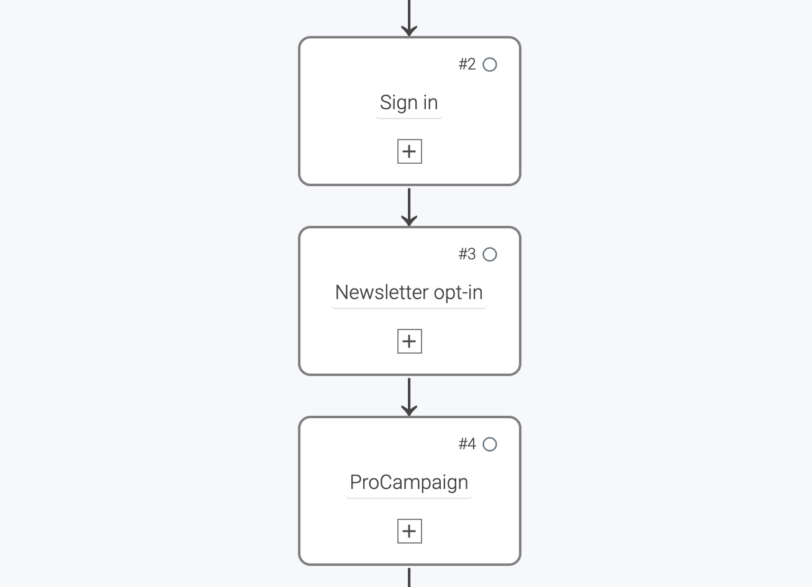
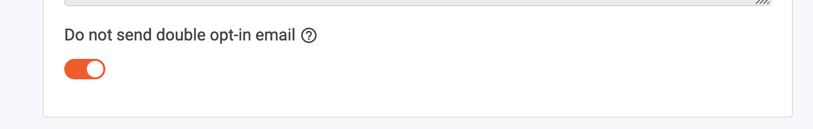
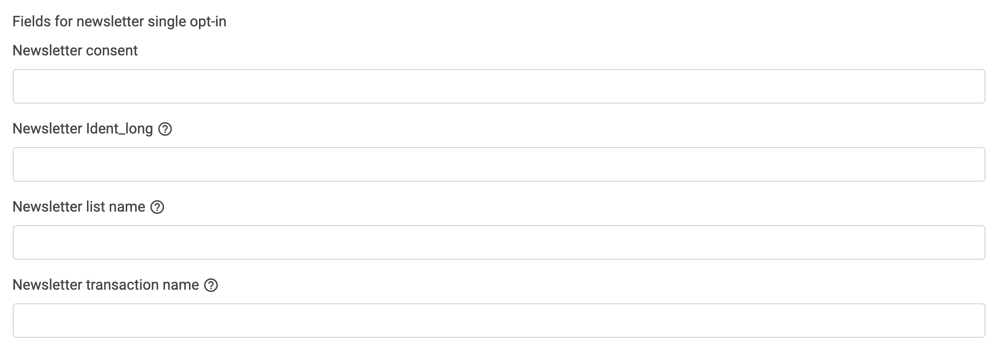

# How to transfer newsletter subscribers from LoyJoy to ProCampaign

## 1. What this solutions will do for you

LoyJoy can acquire newsletter subscribers in any chat flow that contains the 'Newsletter Opt-in' process building block. 

It's easy to **automatically add new newsletter subscribers to your ProCampaign database**. LoyJoy will transfer the single opt-in to ProCampaign and ProCampaign will then send the double opt-in email to the new subscribers. In LoyJoy you will only see the single opt-ins, while ProCampaign will also store the double opt-ins. This is a one-way integration, meaning that subscribers and their opt-ins are only managed in ProCampaign.

## 2. What you need for this solution

To send newsletter subscribers from LoyJoy to ProCampaign you need three things - your ProCampaign administrator will help you:

 - The name of your **newsletter transaction** in ProCampaign.
 - The name of your **newsletter list** in ProCampaign.
 - An **API key that has the needed rights** to modify the attributes / send the transaction.

## 3. Add the Newsletter Opt-in process block to your chat flow

Create or copy an new experience and add the following three process blocks:
- `Sign in`  
- `Newsletter opt-in`
- `ProCampaign`

  

Close the process editor and open the `Newsletter opt-in` process block.

  

Use the 'Do not send double opt-in email' button as this email is sent by ProCampaign.

  

Now we configure our process block 'ProCampaign' to transfer the data from LoyJoy into a corresponding transaction and data field in ProCampaign.

  

Now you can test the data transfer and you are ready to go! :tada:

## 4. Configure the data transfer

You have completed all configurations within the chat. Now you have to set up the data transfer.

On the LoyJoy platform, go to Settings and then choose Integration. Select ProCampaign and click on "Add now".

  

This will add a new tab called "ProCampaign" below.

Scroll down to "General Settings".

Specify a name for your integration (as you can have multiple integrations, this will help you keep track).
Enter **your API key** which you received from your ProCampaign administrator.

  

  

Open the section `Fields for newsletter single opt-in`. Now fill in the `Newsletter list name` and the `Newsletter transaction name` into the according fields in LoyJoy. 

  

 The following fields are optional:
- 'Newsletter consent': If this is set, the text that the user has confirmed in the chat to subscribe will be sent to ProCampaign as an attribute.
- `Newsletter identity_long`: Ident_long transaction parameter (default setting is "Newsletter subscription")

Scroll down and activate the integration for your bot in the field "Choose on which bots the integration should be active". Click "Add an association" to create an association for the email field. Then select 'Process Variable' and enter **customer_email** to refer to your data field in your chat flow. Now simply enter the source name of the data field in ProCampaign **Email**.

  

Congratulations! You have just successfully connected your LoyJoy chatbot to ProCampaign and all newsletter opt-ins within the chat are automatically transferred to ProCampaign.:tada:
