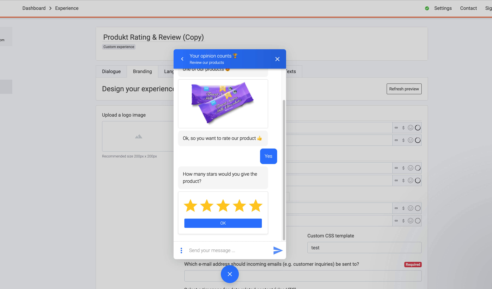
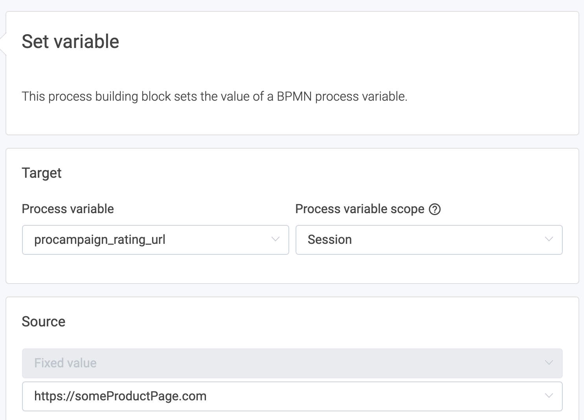
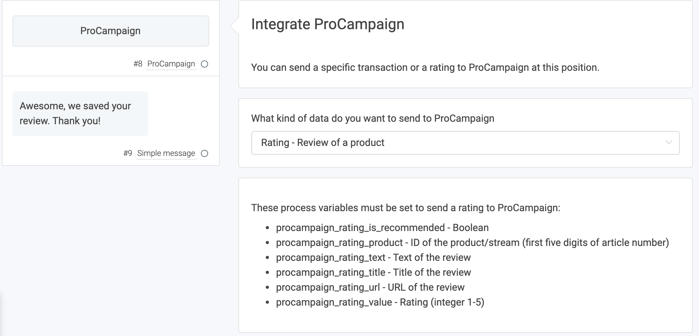
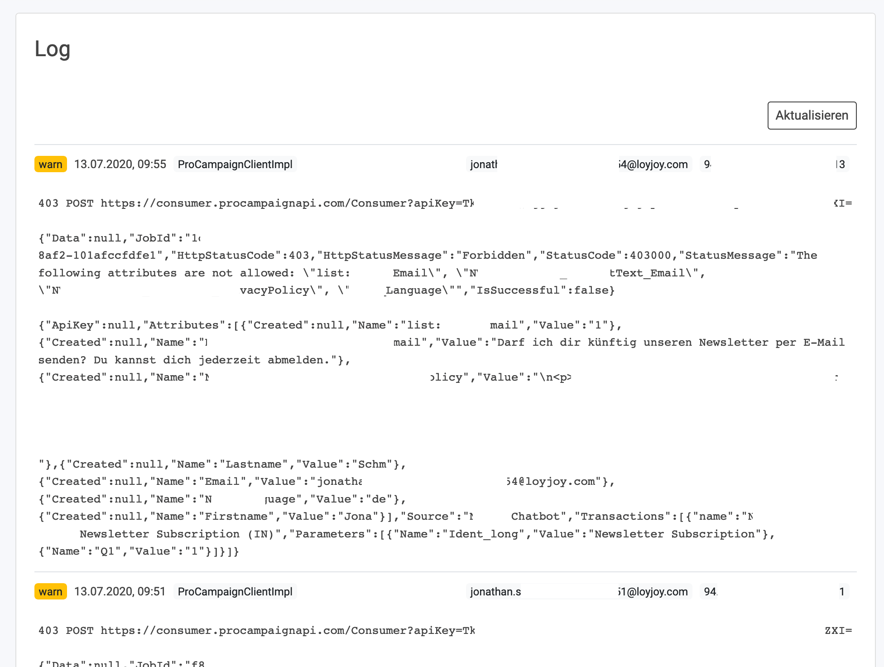

# How to transfer ratings and reviews from LoyJoy to ProCampaign

## 1. What this solution will do
 
Customers will be able to rate a product within the LoyJoy chat. In this article we explain how to then automatically tranfer the ratings to ProCampaign.

  
  

## 2. What you need for this solution to work

 - You need to **define certain process variables in your chat flow**. You do this to collect the specific data inputs from our customers.  
 - Add the **ProCampaign Process block** to your chatflow.  
 - Your ProCampaign admin will provide you with an **API key for ProCampaign** that must be set up to allow the data transfer.  

## 3. Set Variables in the LoyJoy Process Flow

To build a chatbot which collects ratings and reviews from your customers, we have to add a `Questionnaire` process block to our chat flow. A `Questionnaire` should be used when user input is needed. In case your data is not influenced by the customers' input, you can add a `Variable` process block to your flow.

In LoyJoy you can create custom data fiels, we call them variables, and store them in the LoyJoy customer database. All the data we send to ProCampaign for the review must first be defined as variables.

We will create a rating `Questionnaire` to let our customers rate our chocolate on a 5-star scale.

Drag a `Questionnaire` process block to your chatflow and choose the question type `rating`. Than type your question into the question field. Click on the settings button on the process brick and choose the suitable ProCampaign Variable. 

### You need to integrate some components in the chatflow to create a full review:

  - A **sign up**  
  Use the sign up process block to get the email adress of the customers. This is required to tranfer a valid rating to ProCampaign. 
  
  - A **product**    
  This can be identified through a fixed sources such as placing it on a product page. Use a Variable at the beginning of your flow to define your object.   
  **procampaign_rating_product** - `Variable` / `Questionnaire`
  
  - The **link to the product page or origin of the product**  
  Add a variable to determine the source and use variable name:  
  **procampaign_rating_url** - `Variable` / `Questionnaire`
  
  
  
    
  

  - Ask your customers if they would recommend the product     
  **procampaign_rating_is_recommended** -`Questionnaire` 
  
  - Ask your customers to enter their review  
  **procampaign_rating_text** - `Questionnaire`
  
  - Ask your customers to give their review a title  
  **procampaign_rating_title** - `Questionnaire`
  
  - Ask your customers to give your a star rating   
  **procampaign_rating_value** - `Questionnaire`

  
  
    
  

Make sure you included all `ProCampaign` process variables mentioned above in your chat flow.

## 4. Set up the ProCampaign process block

After you defined your variables of the rating data which you would like to transfer to ProCampaign, you simply add a `ProCampaign` process block to your flow.

In the process block, select `Rating - Review a product`.

  
  

## 5. Configure the data transfer

You completed all the configurations within the chat. Now you have to set up the data transfer.

On the LoyJoy platform, go to settings, then choose integration. Choose ProCampaign and click on "Add now".

  

This will add a new tab with the name "ProCampaign" below the cards.

Scroll down to "General settings".

Set a name for your integration (since you can have several integrations this will help you keeping track of)
Enter your API key that you got from your ProCampaign admin

  

The requirement for the API keys is different, depending on whether reviews are only allowed for logged in users or for all users:

  - if reviews are open: Only normal API key is needed
  - if only logged-in users can send reviews: Add alternative API key (for cookie requests) -> should have more rights in ProCampaign

Now scroll down until you see a tab called "Add mapping". A mapping maps field names from LoyJoy to field names in ProCampaign.

- Choose the LoyJoy bot(s) that you want to use the integration in (here: "MyBot")
- Click "Add mapping" to add a new mapping
- Choose "Process variable" from the Source dropdown
- Enter the variable name from LoyJoy that you want to transfer as Source (here: "customer_email") -> **the variable customer_email will transfer the ratings and review data to ProCampaign**
- Enter the target name of the data field that you store in ProCampaign (here: "Email")

  
  

Now you can test the data transfer and you are ready to go!

## 6. Typical obstacles

If you run into problems, here are some typical solutions:
- Have you selected the right bot(s) in the integration settings?
- Are the field names in ProCampaign written correctly?
- Has your API key the necessary rights? (check out the log in LoyJoy for error messages, you find it at the bottom of the page settings > integrations)

  

