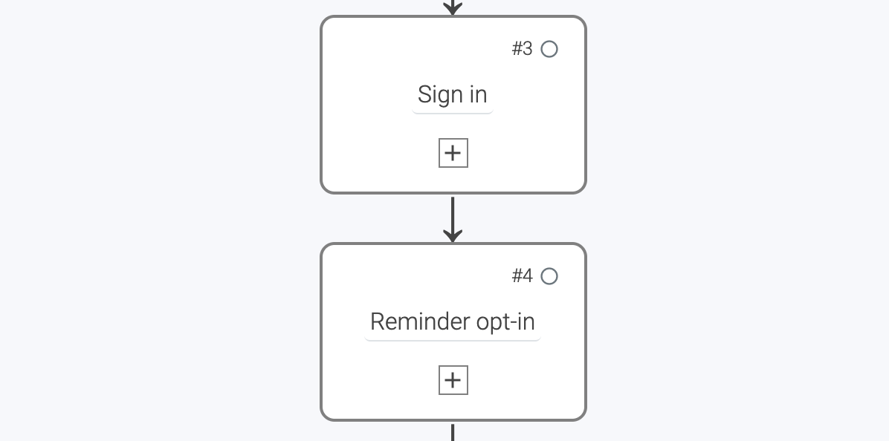
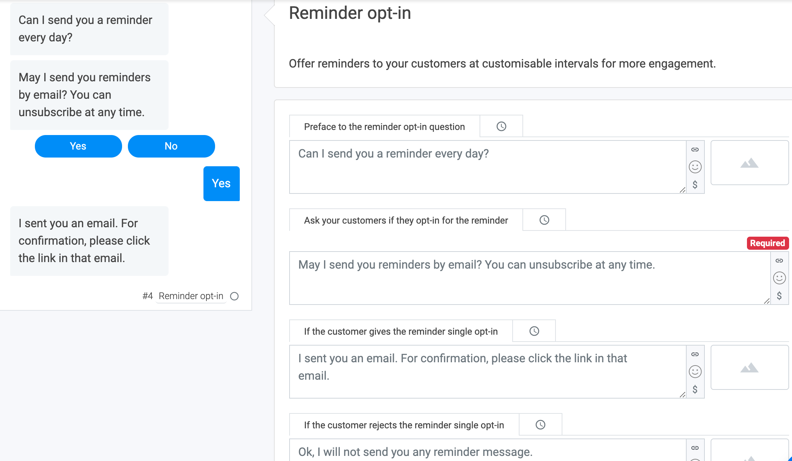
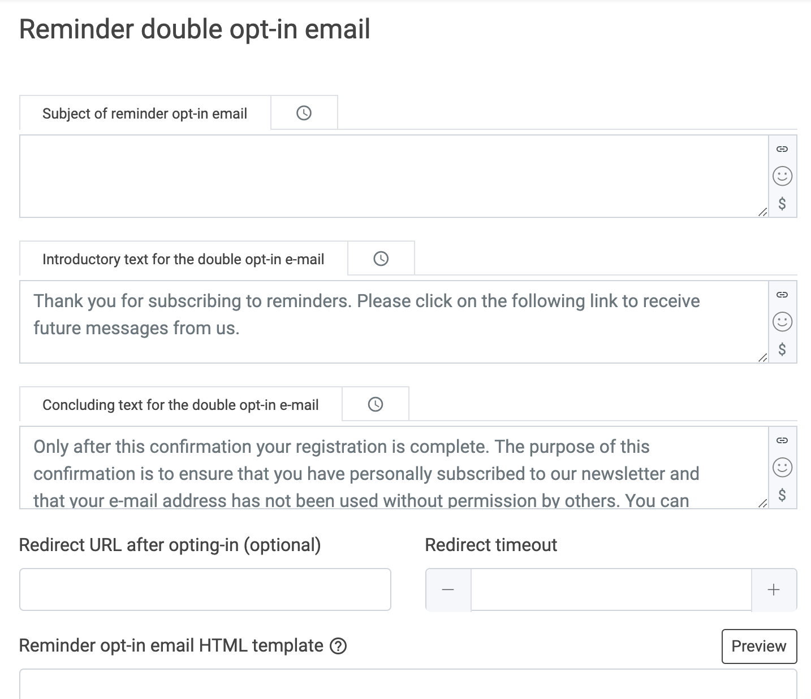
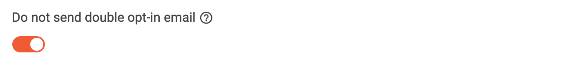
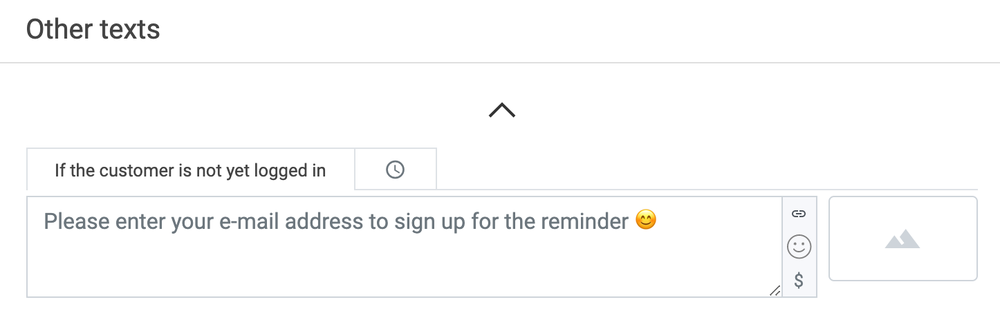
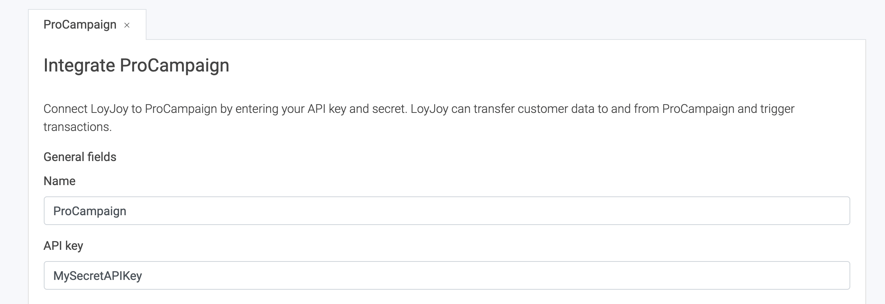
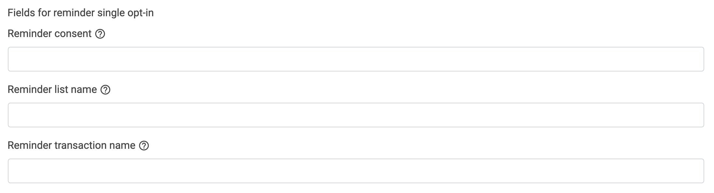
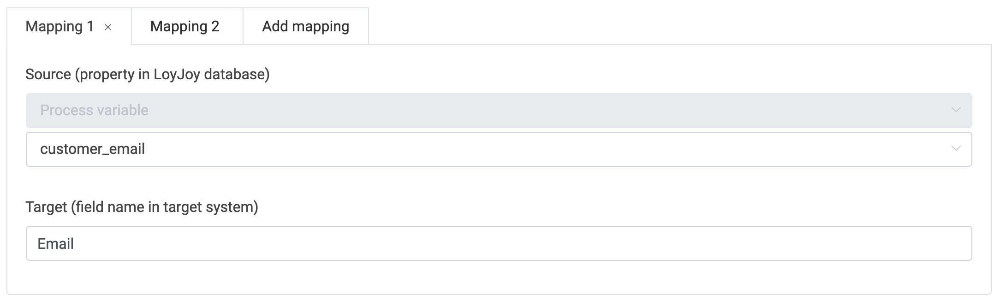

# How to send reminder emails from ProCampaign

## 1. What this solutions will do for you

Some of your chatbots aim to get customers to return again and again. Loyalty and Advent Calendars are use cases where your customers regularly return to the chatbot. You can offer to remind your customers via email to ensure that they return. This article describes **how you can use ProCampaign** to send reminder emails to your customers. LoyJoy will automatically transfer your reminder email data to ProCampaign.

## 2. What you need for this solution

To start transfer the participants from LoyJoy to ProCampaign you will need three things - **your ProCampaign admin will help you out** with this:

 - The **Reminder list name** in ProCampaign
 - The **Reminder transaction name** in ProCampaign
 - The **API key that has the needed rights** to send the transaction

## 3. Add required process blocks to your chat flow

Create or copy an experience and add the **`Reminder opt-in`** process block to your chatflow. This collects permissions from customers to send them reminder emails. Also add the **`Sign In`** process block if your chatflow does not have it yet. The sign up process block collects the email adresses from your customers.

  

## 4. Configure the Reminder opt-in process block

Close the process editor and go to the `Reminder opt-in` process block. Here you can edit the texts displayed in the chat. Only the `Ask your customers if they opt-in for the reminder` field is required.

  

In the `Reminder double opt-in email` section, you can configure the email which will be sent to your customers as a reminder to return to your chat experience. Because we want to send our reminder emails from ProCampaign, we will activate the button `Do not send double opt-in email` in order to deactivate the LoyJoy built-in email service.

  

  

Scroll down to `Other texts` and edit the field `If the customer is not yet logged in` to configure the message which will ask your customers to enter their email address to be reminded via email.

  

Cool! :tada: You just created your reminder email option in the LoyJoy chat. Congrats!

## 5. Configure the data transfer

You've completed all the configurations within the chat. Now you have to set up the data transfer.

On the LoyJoy platform, go to settings, then choose integration. Choose ProCampaign and click on "Add now".

  

This will add a new tab with the name "ProCampaign" below the cards.

Scroll down to "General settings".

Set a name for your integration (since you can have several integrations this will help you keep an overview).
Enter **your API key** that you got from your ProCampaign admin.

  

 

Scroll down to the section 'Fields for reminder single opt-in'. Now enter the **Reminder list name** and the **Reminder transaction name** in the corresponding fields in LoyJoy. This will trigger the associated action in ProCampaign and send the requested reminder email to your customer. Optionally, you can also enter the name of the attribute where the reminder agreement text from the chat is written in the **Reminder consent** field.

  

Scroll down and activate the integration for your bot in the field "Choose on which bots the integration should be active". Click on "Add a mapping" to create a mapping for the email field. Then choose `process variable` and type in **customer_email** to refer to your data field in your chat flow. Now just type in the source name of the data field in ProCampaign **Email**.

  

Congratulations! You just have successfully connected your LoyJoy chatbot with ProCampaign and from now on all reminder emails will be automatically sent by ProCampaign. Good job! :tada:
