# Questionnaire 

The **`Questionnaire`** is a powerful process building block to collect different types of customer data and to interact with customers.

## The process building block **Questionnaire**
Add a new chatbot experience or copy an excisting experience. Then add the process block **`Questionnaire`** in the process editor.

  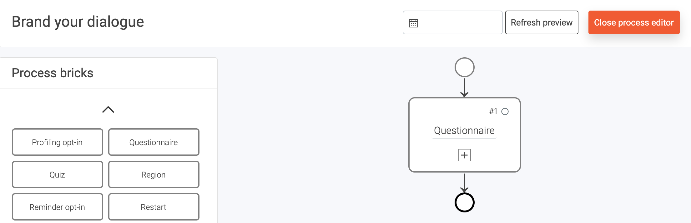

Now close the process editor to access the process building block `Questionnaire`. 

  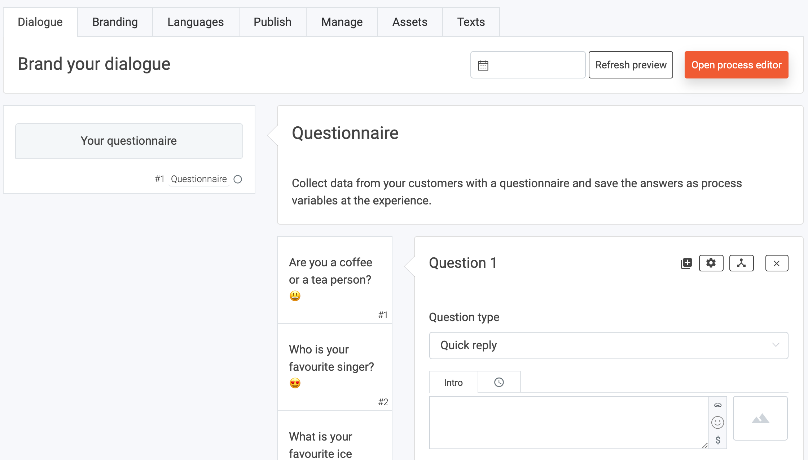

You can add questions here and select the `Question type`. Give your question an (optional) introduction text while using the text field ´Intro´ to post a simple message before your question. Enter your question in the `Question` field. You can also set an (optional) message that will be sent regardless of the response from your customers with the text field `React to an answer`. `Add answer` options if your type of question requires pre-set answers. 

  

  

## Let's look at the **different question types** of the Questionnaire.

You can choose from a range of different question types according to your objectives. You will gain an insight into the functions and the design of the possible questions.

### List of Question Types 

- [Accordion](#Accordion)
- [Address query](#Address-query)
- [Categorical slider](#Categorical-slider)
- [Date input](#Date-input)
- [Dropdown select](#Dropdown-select)
- [File upload](#File-upload)
- [Gallery image select](#Gallery-image-select)
- [Horizontal slider](#Horizontal-slider)
- [IBAN input](#IBAN-input)
- [Image upload](#Image-upload)
- [Multiple choice](#Multiple-choice)
- [Numerical input](#Numerical-input)
- [Numerical slider](#Numerical-slider)
- [Ordering/prioritize](#Ordering/prioritize)
- [Phone number](#Phone-number)
- [Quick reply](#Quick-reply)
- [Rating](#Rating)
- [Single choice](#Single-choice)
- [Text input](#Text-input)

### Quick reply

One of the most used question type. This question type creates the famous button design. 

  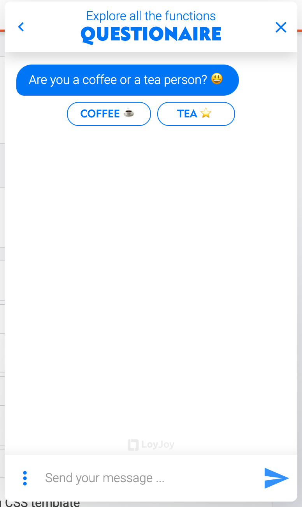

### Accordion

If your answer option are a little bit longer, use the Accordion to provide more complex answer options and have your customer unfold the answers.

  

### Address query

Your customer is asked to enter his address. This is supported by Google Maps and suggests addresses before the input is completed.

  

### Categorical slider

Define categories and ask the customer to find his opinion on the slider.

  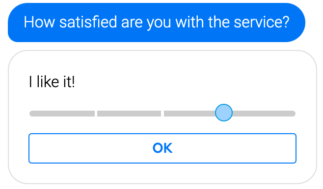

### Date input

Ask your customer to select a date.

  

### Dropdown select

Create a dropdown menu and let your customer choose one of the given options.

  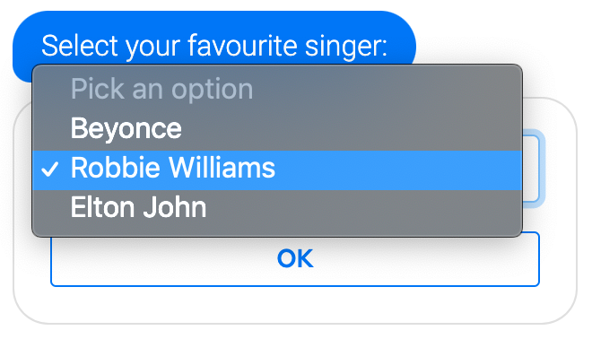

### File upload

Ask your customer to upload a file from his computer or phone.

  

### Gallery image select

Let your customer choose one picture from multiple provided.

  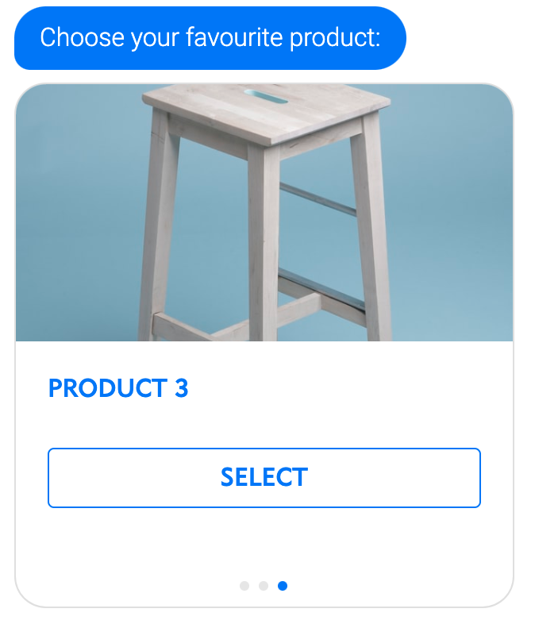

### Horizontal slider

The horizontal slider gives you the possiblity to present content and have your customer select from the options.

  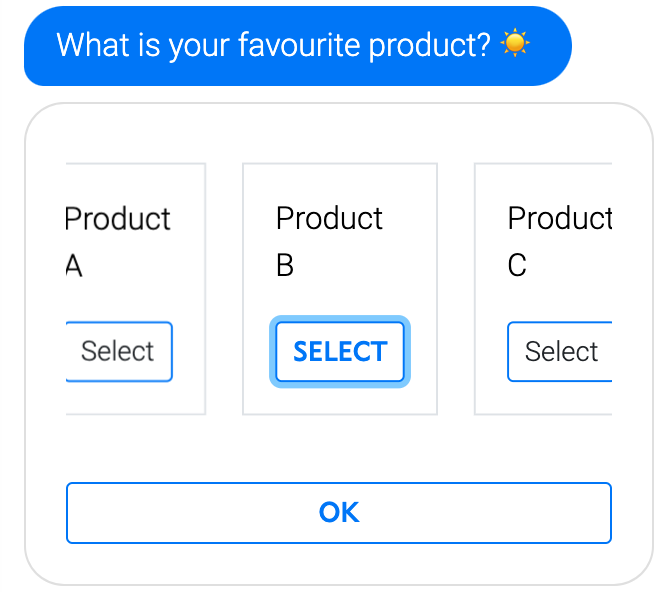

### IBAN input

Ask your customer to enter his IBAN. For privacy reasons, this data will not be shown in the analytics.

  

### Image upload

Your customer can upload an image from his computer or phone.

  

### Multiple choice

Let your customer select multiple answer options.

  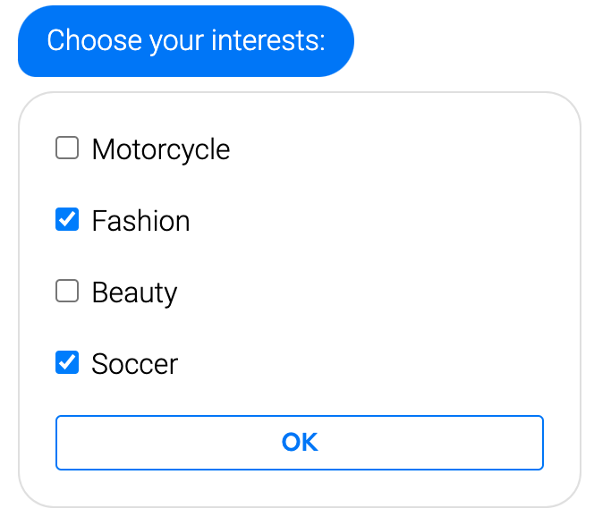

### Numerical input

Ask your customer to enter a precise number.

  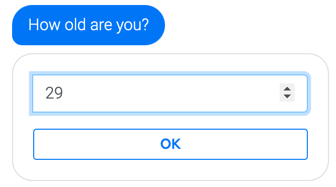

### Numerical slider

Ask your customer to give you feedback on a slider. You can set the minimum and maximum value of your slider and choose from the percentage (32%), floating-point number (5.676,...) or Integer (3,4,...).

  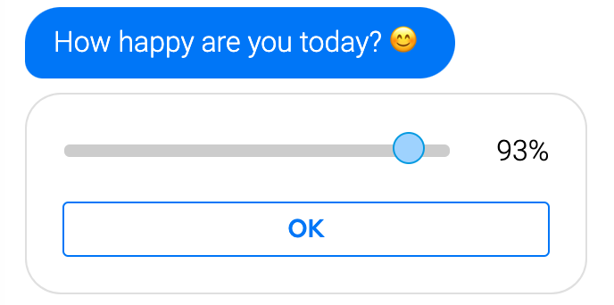

### Ordering/prioritize

You customer can prioritize the given answer options by clicking the answers.

  

### Phone number

Ask your customer for a phone number.

  

### Rating

Use this question to receive feedback from your customers. Let them choose to give you one to five stars or hearts.

  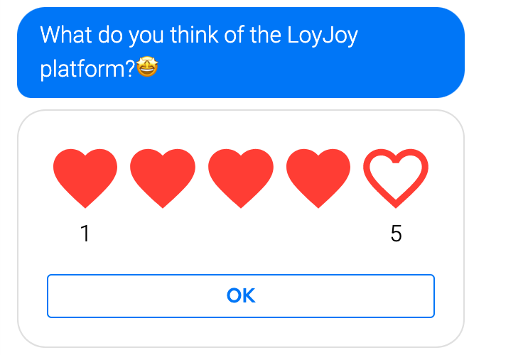

### Single choice

Ask your customers to pick one out of many answer options.

  

### Text input

Ask your customer to type something. 

  

