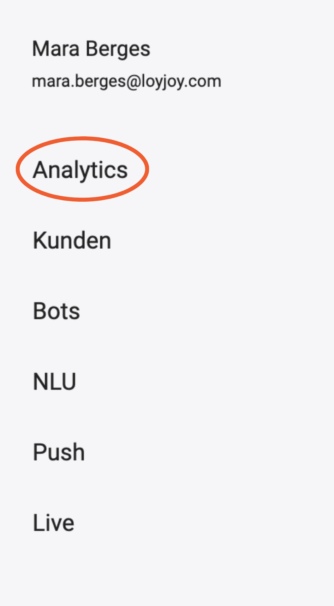

### How to Measure Success

Nothing is better than success. Find your boosted performance and learn about your customers on the LoyJoy Analytics Dashboard.

Here you will find general KPIs such as the screen time, participants, and newsletter subscribers for each of your chat experiences.

  
  

Depending on your chat experience, you will find information on your customers' behaviour in the chat. 

  
  
  
  
  
  

Now it's time to celebrate your first successful LoyJoy chatbot! Enjoy! :tada:
